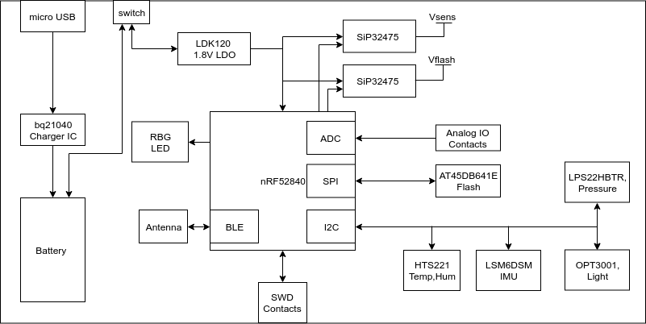
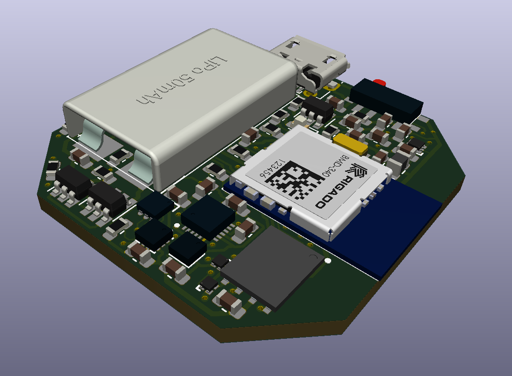

# BLE5 node for prototyping

## Hardware Design

The designed system is built around Nordic nRF52840 module that is used as a main
communication and processing unit. 
Nordic Semiconductor’s nRF52840 Bluetooth Low Energy (BLE) System-on-Chip
(SoC) — the high-end variant of Nordic’s nRF52 Series of high-performance
Bluetooth 5-certified SoCs — brings a production-ready, multiprotocol wireless
IoT solution to the market with the full Bluetooth 5 support and support for Bluetooth
mesh and Thread.

The SoC offers the capabilities and flexibility to support a broad range of networked,
connected products for wearables, gaming, VR/AR, as well as home and industrial IoT applications
thanks to a wide range of features and peripherals.

The high-end nRF52840 SoC, based on Nordic’s proven nRF52 Series architecture,
is the first single-chip solution to bring all of the benefits of Bluetooth 5 to the market.
The key advantages of Bluetooth 5 compared to the previous implementations of the BLE specification
include: 2× on-air raw data bandwidth (2 Mb/s); 4× range; 8× broadcasting ability with advertising
extensions that increase the advertising packet payload size to 251 bytes; and an improved channel
coexistence algorithm.

The nRF52840 SoC uses a 64-MHz, 32-bit Arm Cortex M4F processor, floating point, and DSP performance
to meet the demands of challenging wireless applications. The SoC can also operate from the power
supplies above 5 V, such as rechargeable battery power sources.

Other features include a new radio architecture with a +8-dBm on-chip PA, 1-MB flash and 256-kB RAM,
IEEE 802.15.4 (including Thread), ANT, Zigbee, and proprietary 2.4-GHz wireless technologies;
a full-speed USB 2.0 controller; and a host of peripherals including a quad-SPI interface.
In terms of security, the SoC incorporates an Arm CryptoCell-310 cryptographic accelerator.
Extensive crypto-ciphers and key generation and storage options are also available.

There is a set of sensors to measure ambient and usage conditions: 

1. Temperature, humidity for monitoring environment (HTS221).
2. Inertial Measurement Unit(IMU) Accelerometer, gyroscope for monitoring node position, movement and fall detection (LSM6DSM).
3. Pressure sensor for altitude monitoring(LPS22HBTR, also can be used for navigation purposes)  
4. Lighting intensity sensor (OPT3001).

These sensors use I2C bus for communication with Nordic MCU.

The 1.8V LDO is used to power the system from LiPo battery. All the components were selected to run from low voltage level.
There are 2 power switches on the board that are controlled by Nordic chip. These switches are used to power sensors and flash memory.
To minimize power consumption during the sleep mode they can be turned off.

